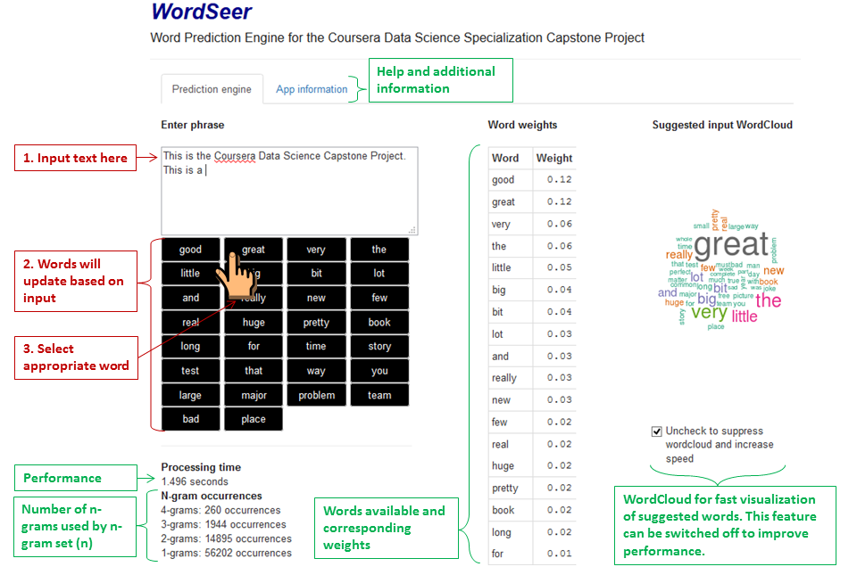

WordSeer - Word Prediction Engine
========================================================
author: German Campuzano
date: March 31, 2015

**Data Science Specialization Capstone Project**   
-Coursera  
-John Hopkins Bloomberg School of Public Health   
-SwiftKey 

The source code for the project is available on [GitHub](https://github.com/gcampuzano14/Coursera-Data-Science-Capstone-Project)  
The app: [WordSeer](https://gcampuzano14.shinyapps.io/WordSeer_ShinyApp/)

WordSeer Highlights
========================================================
Try [WordSeer](https://gcampuzano14.shinyapps.io/WordSeer_ShinyApp/) now! 

- Live app responsiveness to text input 
- Displays top 30 word possibilities with weighted scores
- WordCloud display for fast visualization of suggested words
- Handles and respects punctuation and special characters in user input
- The size of data used by language model is 99.8Mb with an average bytes/ngram: 80.5 bytes/ngram; this guarantees fast performance and minimal loading time.

Instructions
========================================================

The Underlying Algorithm
========================================================
- The model was trained using a random sample of 5% from the [HC corpora](http://www.corpora.heliohost.org/) containing English documents from twitter, blogs and news feeds ([descriptive statistics](https://rpubs.com/gcampuzano14/coursera_capstone_milestone)).
- Data for each N-gram (range of N = 4 - 1) collection is stored in hash tables (R [data.table](http://cran.r-project.org/web/packages/data.table/index.html) and [spooky.32](http://cran.r-project.org/web/packages/hashFunction/hashFunction.pdf) for efficiency).
- WordSeer employs a  Markov process and is based on a modified "Stupid Backoff" algorithm ([Brants 2007](http://www.cs.columbia.edu/~smaskey/CS6998-0412/supportmaterial/langmodel_mapreduce.pdf)). Using all input N-grams (4-grams - 1-grams) it calculates the probability for all the words following that N-gram (MLE). These probabilities are summed across all N-gram collections (1 to k) to obtain a weight (W).
$$W_{word}=\sum_{n=1}^k(MLE_{word})_{n}$$   

Further Exploration
========================================================
1. Context information is discarded for n-grams where n > 4.
2. The average bytes per N-gram can be further decreased by storing unique words as numbers for the higher order M-grams.
3. Implementation of interpolation (Key-Neisser algorithm) may improve prediction accuracy but decrease performance.
4. Table of know contractions can allow for their use in the model.

The app: [WordSeer](https://gcampuzano14.shinyapps.io/WordSeer_ShinyApp/)
